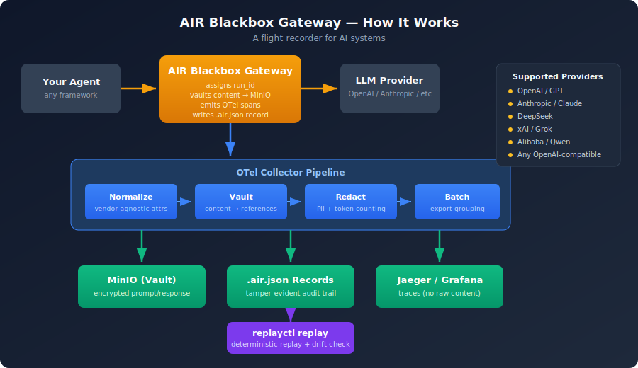

# AIR Blackbox Gateway

[](https://github.com/nostalgicskinco/air-blackbox-gateway/actions/workflows/ci.yml)
[](https://go.dev)
[](LICENSE)
[](https://opentelemetry.io)

**A flight recorder for AI systems. Every LLM call your agents make passes through this gateway, producing a tamper-evident, replayable audit record — without exposing sensitive content to your observability stack.**

When an autonomous agent sends an email, moves money, or changes data, someone will eventually ask: *"Show me exactly what the AI saw and why it made that decision."* Today, most organizations cannot answer that. AIR Blackbox Gateway is the missing infrastructure — an OpenAI-compatible reverse proxy that records every decision an AI system makes so you can reconstruct incidents, prove compliance, and replay runs deterministically.

> **See it in action:** [Interactive Test Suite Demo](https://nostalgicskinco.github.io/air-blackbox-gateway/test-suite-demo.html) — 30 tests across 8 LLM providers, security validation, and concurrency checks.

## Who Is This For?

**ML / Platform Engineers** — You're deploying agents that call LLMs. You need every request and response recorded without leaking PII into your observability stack. Drop this in front of your provider and get vault-backed audit trails with zero code changes.

**Compliance & Security Teams** — Your organization is shipping AI features and regulators are asking questions. You need tamper-evident records that prove exactly what the AI saw, what it decided, and when. AIR records give you legal-grade reconstruction with SHA-256 checksums.

**Startup CTOs** — You're moving fast but know that "we can't prove what our AI did" will eventually become a blocker for enterprise deals, SOC 2, or insurance. This is the infrastructure you install now so you're not scrambling later.

**Teams Building Autonomous Agents** — You're moving beyond chatbots toward agents that operate across hours or days, calling tools, making decisions, and interacting with real systems. You need risk-tiered autonomy, decision provenance, and the ability to replay any agent run. The trust layer gives you compliance-grade evidence that your agent did the right thing — or a clear record of exactly where it didn't.

## How It Works

<p align="center">
  
</p>

1. Your agent sends an OpenAI-compatible request to the gateway (just change the base URL)
2. The gateway assigns a `run_id`, forwards the request, captures the response
3. Raw prompts and completions are vaulted in MinIO (S3-compatible) — traces contain **references**, not content
4. An AIR record file captures the full run: vault refs, model, tokens, timing, tool calls
5. OTel spans flow through the collector pipeline (normalization → vault → redaction → export)
6. Later: `replayctl replay runs/<id>.air.json` replays the run and reports behavioral drift

## Why Not Just Use Langfuse / Helicone / Datadog?

Those are **observability** tools — they answer *"how is the system performing?"*

This is an **accountability** tool — it answers *"what exactly happened and can we prove it?"*

| Capability | Observability Tools | AIR Blackbox Gateway |
|---|---|---|
| Dashboards & latency | ✅ | ❌ (use Jaeger/Grafana) |
| Prompt/response storage | In their cloud | In **your** vault (S3/MinIO) |
| PII-safe traces | ❌ (stores raw content) | ✅ (vault references only) |
| Deterministic replay | ❌ | ✅ (`replayctl`) |
| Tamper-evident records | ❌ | ✅ (SHA-256 + HMAC chain) |
| Legal-grade reconstruction | ❌ | ✅ |
| Compliance reporting (SOC 2, ISO 27001) | ❌ | ✅ (22 controls, auto-evaluated) |
| Signed evidence export | ❌ | ✅ (HMAC-attested packages) |
| Agent guardrails & kill-switch | ❌ | ✅ (cost, loop, tool, PII) |

## Quick Start (5 minutes)

### Prerequisites

- Docker & Docker Compose
- An OpenAI API key (or any OpenAI-compatible provider)

### 1. Configure

```bash
cp .env.example .env
# Edit .env and add your OPENAI_API_KEY
```

### 2. Start the stack

```bash
docker compose up --build
```

This starts: the gateway (`:8080`), MinIO (`:9000`), an OTel Collector, and Jaeger (`:16686`).

### 3. Make an agent call

```bash
curl http://localhost:8080/v1/chat/completions \
  -H "Content-Type: application/json" \
  -H "Authorization: Bearer $OPENAI_API_KEY" \
  -d '{
    "model": "gpt-4o-mini",
    "messages": [{"role": "user", "content": "What is a flight recorder?"}]
  }'
```

The response includes an `x-run-id` header — that's your audit trail.

### 4. View traces

Open Jaeger at [http://localhost:16686](http://localhost:16686) — search for service `air-blackbox-gateway`.

### 5. Replay a run

```bash
# List recorded runs
ls runs/

# Replay and check for drift
go run ./cmd/replayctl replay runs/<run_id>.air.json
```

## Standalone (without Docker)

```bash
go build -o gateway ./cmd/gateway
go build -o replayctl ./cmd/replayctl

# Gateway
export OPENAI_API_KEY=sk-...
export VAULT_ENDPOINT=localhost:9000
export VAULT_ACCESS_KEY=minioadmin
export VAULT_SECRET_KEY=minioadmin
export OTEL_EXPORTER_OTLP_ENDPOINT=localhost:4317
./gateway --addr :8080

# Replay
./replayctl replay runs/<run_id>.air.json
```

## AIR Record Format

Each run produces a `.air.json` file — a portable, self-contained audit record:

```json
{
  "version": "1.0.0",
  "run_id": "550e8400-e29b-41d4-a716-446655440000",
  "trace_id": "abc123...",
  "timestamp": "2025-02-14T10:30:00Z",
  "model": "gpt-4o-mini",
  "provider": "openai",
  "endpoint": "/v1/chat/completions",
  "request_vault_ref": "vault://air-runs/550e8400.../request.json",
  "response_vault_ref": "vault://air-runs/550e8400.../response.json",
  "request_checksum": "sha256:a1b2c3...",
  "response_checksum": "sha256:d4e5f6...",
  "tokens": {
    "prompt": 25,
    "completion": 142,
    "total": 167
  },
  "duration_ms": 1230,
  "status": "success"
}
```

## Collector Pipeline

The OTel Collector runs your existing processors in order:

```yaml
processors:
  genai_semantic_normalizer:    # Vendor-agnostic attribute names
  prompt_vault:                  # Offload content → MinIO references
  genai:                         # Redaction, token counting, loop detection
  batch:                         # Standard batching

service:
  pipelines:
    traces:
      receivers: [otlp]
      processors: [genai_semantic_normalizer, prompt_vault, genai, batch]
      exporters: [otlp/jaeger, debug]
```

## Architecture

AIR Blackbox Gateway is the **spine** of the [nostalgicskinco](https://github.com/nostalgicskinco) GenAI infrastructure portfolio:

| Layer | Repos | Role |
|---|---|---|
| **Gateway** | `air-blackbox-gateway` (this repo) | Proxy + run_id + vault + AIR records + guardrails + trust |
| **Episode Ledger** | [`agent-episode-store`](https://github.com/nostalgicskinco/agent-episode-store) | Groups AIR records into replayable task-level episodes ✅ |
| **Eval Harness** | [`eval-harness`](https://github.com/nostalgicskinco/eval-harness) | Replays episodes, scores results, detects regressions ✅ |
| **Policy Engine** | `agent-policy-engine` | Risk-tiered autonomy, runtime enforcement 📋 |
| **Collector** | `genai-semantic-normalizer`, `prompt-vault-processor`, `opentelemetry-collector-processor-genai`, `genai-cost-slo` | Normalize → vault → redact → metrics |
| **Replay** | `agent-vcr`, `trace-regression-harness` | Record/replay, policy assertions |
| **Governance** | `mcp-policy-gateway`, `mcp-security-scanner`, `agent-tool-sandbox`, `aibom-policy-engine`, `runtime-aibom-emitter` | Tool perimeter, SBOM, security scanning |
| **Trust** | `air-blackbox-gateway/pkg/trust` | Audit chain, compliance mapping, evidence export |

## Operational Guarantees

AIR Blackbox Gateway is a **witness, not a gatekeeper**. It must never become a dependency for uptime.

**Non-blocking** — If the vault (MinIO) is unreachable, the gateway still proxies requests. Your AI system never stops working because recording failed.

**Lossy-safe** — A dropped record is acceptable. A dropped request is not. Recording is best-effort; proxying is guaranteed.

**Self-degrading** — If the OTel Collector is down, spans are dropped silently. If the filesystem is full, AIR records fail gracefully. The gateway logs warnings but never returns errors to your agent.

> **Design principle:** AirBlackBox cannot cause your AI system to fail.

This follows the same contract as Datadog agents, OTel collectors, and other production observability infrastructure. Companies will not insert a system into their AI pipeline if it can break that pipeline.

## Privacy & Data Boundaries

The gateway records AI interactions. Companies will ask: *"Are you storing our customer data?"*

The answer is: **you control all data, and you choose what gets recorded.**

| Recording Mode | What's Stored | Use Case |
|---|---|---|
| **Full vault** (default) | Prompts + completions in your MinIO, references in traces | Complete reconstruction capability |
| **Metadata only** | Model, tokens, timing, run_id — no content | Lightweight audit without content exposure |
| **Hash only** | SHA-256 of request/response, no content stored | Prove *that* a call happened without storing *what* was said |
| **Selective redaction** | Content with PII/PHI fields stripped by the genai processor | Healthcare, fintech, enterprise compliance |

The key insight: *"We can prove what happened without exposing the data."* That's what makes this viable for healthcare, fintech, and enterprise buyers who need accountability but have strict data handling requirements.

See [SECURITY.md](SECURITY.md) for the full data handling policy and threat model.

## What Gets Recorded

An AIR record captures everything needed to reconstruct an incident or replay a run. Beyond the request and response, the gateway captures version and configuration context that matters for root cause analysis:

| Field | Why It Matters |
|---|---|
| `model` | Which model handled this request |
| `provider` | Which provider endpoint was called |
| `timestamp` | When the interaction happened (signed) |
| `run_id` + `trace_id` | Links the record to distributed traces |
| `request_checksum` / `response_checksum` | SHA-256 tamper evidence |
| `vault_ref` | Where the raw content is stored |
| `tokens.prompt` / `tokens.completion` | Token usage for cost and drift analysis |
| `duration_ms` | Latency for performance correlation |
| `status` | Success, error, timeout |

**Why version awareness matters:** Models change silently. OpenAI, Anthropic, and others update weights without notice. When behavior changes and nobody knows why, the first question is: *"Did the model change?"* AIR records let you answer: *"The incident began after the model update at 3:14 PM."*

**Chain of custody:** Every AIR record includes a creation timestamp, checksums, and the identity of the recording system. This isn't just tamper-evidence (proving it wasn't modified) — it's provenance tracking (proving it wasn't mishandled). That's what regulators and lawyers actually verify.

## Trust Layer

The trust layer turns AIR records into cryptographically verifiable audit trails, evaluates your configuration against compliance frameworks, and packages everything into exportable evidence bundles.

### Audit Chain

Every proxied request is appended to an HMAC-SHA256 audit chain. Each entry links to the previous entry's hash, creating a tamper-proof sequence — modify any record and the chain breaks from that point forward. This is the same integrity model used by certificate transparency logs and blockchain systems, without the overhead.

### Compliance Reporting

The gateway evaluates your live configuration against 22 controls across two frameworks:

- **SOC 2 Trust Service Criteria** — 12 controls (CC6.1, CC6.3, CC7.2, CC7.3, CC8.1, CC4.1, CC5.1, CC7.4, CC2.1, A1.2, CC6.6, CC3.1)
- **ISO 27001 Annex A** — 10 controls (A.12.4.1, A.12.4.3, A.14.2.2, A.18.1.3, A.9.1.1, A.10.1.1, A.12.1.1, A.16.1.2, A.12.6.1, A.12.4.4)

Controls pass or fail based on what's actually enabled (vault, guardrails, analytics, audit chain). No self-assessment forms — the gateway evaluates itself.

### Evidence Export

`GET /v1/audit/export` generates a signed evidence package containing the full audit chain, compliance report, time range, and an HMAC attestation. Hand it to your auditor as a single JSON document. The attestation can be independently verified against your signing key.

### Endpoints

| Endpoint | Method | Description |
|---|---|---|
| `/v1/audit` | GET | Chain integrity status + live compliance evaluation |
| `/v1/audit/export` | GET | Signed evidence package for regulators |

Both endpoints require the `X-Gateway-Key` header.

## Roadmap

AIR Blackbox Gateway is an **operational trust layer for autonomous AI systems**. As agents move from chatbots toward durable, multi-step systems that operate across days and interact with real software, the hardest problems are not model intelligence — they are state management, provenance, reproducibility, access control, and measurable safety.

### What's Shipped

| Version | Layer | Capability | Status |
|---|---|---|---|
| **v0.1** | Visibility | Recording, replay, vault, OTel pipeline, 8 providers | ✅ Shipped |
| **v0.1** | Visibility | Non-blocking proxy with streaming, auth, timeout safety | ✅ Shipped |
| **v0.4** | Detection | Runaway agent kill-switch and cost guardrails | ✅ Shipped |
| **v0.4** | Detection | Loop detection, token explosion alerts, webhook alerting | ✅ Shipped |
| **v0.5** | Prevention | Policy enforcement, PII blocking, tool allowlists | ✅ Shipped |
| **v0.5** | Prevention | Human-in-the-loop approval workflows | ✅ Shipped |
| **v0.6** | Optimization | Cross-agent analytics, model routing, failure taxonomy | ✅ Shipped |
| **v0.7** | Trust | Cryptographic audit chain (HMAC-SHA256) | ✅ Shipped |
| **v0.7** | Trust | SOC 2 + ISO 27001 compliance reporting (22 controls) | ✅ Shipped |
| **v0.7** | Trust | Signed evidence package export | ✅ Shipped |

### What's Next (2026–2029)

The roadmap is organized around the principle that autonomous agents need **systems and controls**, not just smarter models. Each phase builds trust infrastructure that becomes mandatory as agents gain more autonomy.

| Phase | Timeline | Focus | Key Deliverables |
|---|---|---|---|
| **Foundation** | Q1–Q2 2026 | Episode model + durable state | Replayable episode schema; durable step persistence with pause/resume; idempotent tool calls |
| **Risk-Tiered Autonomy** | Q3–Q4 2026 | Controllable autonomy | Cost-of-error × confidence gating; approval workflows by risk tier; sandbox replay harness with staging digital twins |
| **Multi-Agent Orchestration** | Q1–Q2 2027 | Reliability at scale | Planner/executor/critic roles; escalation policies; cross-agent shared state; integration hardening |
| **External Trust Wedge** | Q3–Q4 2027 | Go-to-market | Trust layer as distributable add-on; onboarding templates; SOC 2 control inventory; incident runbooks |
| **Autonomy Expansion** | 2028 | Limited autonomy in production | End-to-end low-risk task completion with post-hoc review; cost/latency optimization; marketplace connectors |
| **Enterprise Scale** | Q4 2028–Q1 2029 | Enterprise readiness | Provenance search and replay debugging; multi-tenant isolation; SCIM-based identity provisioning |

### The Value Ladder

```
Visibility (what happened)
  → Detection (something is wrong)
    → Prevention (stop it automatically)
      → Optimization (make it better)
        → Trust (prove it to regulators)
          → Autonomy (let the agent act, safely)
```

Each layer builds on the one below it. You can't detect problems you can't see. You can't prevent what you can't detect. You can't optimize what you can't control. You can't trust what you can't prove. And you can't grant autonomy without trust.

The open-source protocol layer (recording, replay, detection, prevention, optimization, trust) is Apache-2.0. Future commercial services (hosted evidence storage, managed compliance, enterprise identity, multi-tenant governance) are separate offerings.

## Configuration

| Environment Variable | Default | Description |
|---|---|---|
| `LISTEN_ADDR` | `:8080` | Gateway listen address |
| `PROVIDER_URL` | `https://api.openai.com` | Upstream LLM provider |
| `VAULT_ENDPOINT` | `localhost:9000` | MinIO/S3 endpoint |
| `VAULT_ACCESS_KEY` | `minioadmin` | S3 access key |
| `VAULT_SECRET_KEY` | `minioadmin` | S3 secret key |
| `VAULT_BUCKET` | `air-runs` | S3 bucket for vault storage |
| `VAULT_USE_SSL` | `false` | Use TLS for S3 |
| `OTEL_EXPORTER_OTLP_ENDPOINT` | `localhost:4317` | OTel collector gRPC endpoint |
| `RUNS_DIR` | `./runs` | Directory for AIR record files |
| `TRUST_SIGNING_KEY` | *(none)* | HMAC-SHA256 key for audit chain signing |

## Project Philosophy

Autonomous AI agents are moving from chatbots toward durable, multi-step systems that operate across days, interact with real software, and are governed by risk controls rather than by prompts alone. The hardest problems in this shift are not model intelligence — they are operational trust: state management, provenance, reproducibility, access control, and measurable safety.

AIR Blackbox Gateway exists because every organization deploying agents will eventually need to answer three questions: *What did the AI do? Can we prove it? Can we control what it does next?* The five shipped layers (visibility, detection, prevention, optimization, trust) answer all three today. The roadmap extends toward the sixth: **safe autonomy** — letting agents act independently within provable boundaries.

The open-source protocol layer will always be Apache-2.0. We believe the path to adoption is:

**Open protocol → common dependency → operational expectation → compliance requirement.**

That only works if the foundation is genuinely open, genuinely useful, and genuinely trustworthy.

## License

Apache-2.0 — see [LICENSE](LICENSE) for details.

The goal is to create an open standard for recording and replaying AI system behavior. See [COMMERCIAL_LICENSE.md](COMMERCIAL_LICENSE.md) for information about future commercial governance services.
